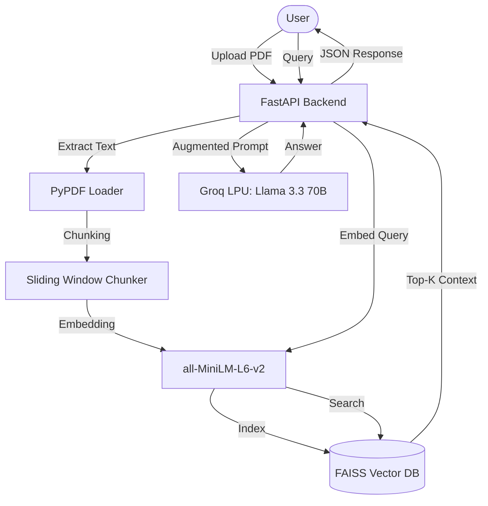

# 📄 RagDoc: AI-Powered Document Intelligence

[](https://opensource.org/licenses/MIT)
[](https://www.python.org/)
[](https://react.dev/)
[](https://groq.com/)

**RagDoc** is a high-performance, enterprise-grade Retrieval-Augmented Generation (RAG) system designed to transform static PDF documents into interactive intelligence. Built with a focus on speed, precision, and modern aesthetics, it enables users to query complex documents using natural language and receive grounded, cited answers in milliseconds.

---

## 🏗️ System Architecture

RagDoc utilizes a decoupled architecture to ensure scalability and high performance.



---

## 🚀 Key Technical Specifications

### 🧠 Intelligence & Retrieval
- **LLM Engine:** Powered by `Llama-3.3-70b-versatile` via Groq LPU, delivering state-of-the-art reasoning with sub-second response times.
- **Vector Embeddings:** Uses `all-MiniLM-L6-v2` generating **384-dimensional dense vectors** for high-accuracy semantic retrieval.
- **Indexing:** Leveraging **FAISS (Facebook AI Similarity Search)** for O(log N) search complexity, even with large-scale document sets.
- **Chunking Strategy:** Intelligent **Sliding Window** processing with 300-word chunks and 50-word overlap to maintain semantic context across boundaries.

### 🛡️ Security & Performance
- **Authentication:** JWT-based session management with **24-hour expiration** and **Argon2id** password hashing (industry-standard for GPU-resistance).
- **Concurrency:** Built on **FastAPI (Asynchronous Server Gateway Interface)** for handling high-volume concurrent requests.
- **UI Engine:** React 19 + Vite for optimized bundle sizes and **Framer Motion** for GPU-accelerated 60FPS transitions.

---

## ✨ Features

- **End-to-End RAG Pipeline:** Automatic PDF processing, text extraction, and vector indexing.
- **Glassmorphism UI:** A premium dark-themed interface with semi-transparent materials and indigo accents.
- **Source Transparency:** Every AI response includes exact citations and text highlights from the source document.
- **Multi-User Isolation:** Secure document silos ensuring users only access their own data.
- **Mobile Responsive:** Fully adaptive layout optimized for desktop, tablet, and mobile.

---

## 🛠️ Tech Stack

| Layer | Technologies |
| :--- | :--- |
| **Frontend** | React 19, TypeScript, Tailwind CSS, Framer Motion, Vite |
| **Backend** | FastAPI, Python 3.10+, PyPDF, Uvicorn |
| **AI/ML** | Groq (Llama 3.3 70B), Sentence-Transformers (MiniLM), FAISS |
| **Database** | SQLite (Metadata), FAISS Index (Vectors) |
| **DevOps** | Docker, Docker Compose, .env Configuration |

---

## 📦 Getting Started

### Prerequisites
- Python 3.10+
- Node.js 18+
- [Groq API Key](https://console.groq.com/)

### Installation

1. **Clone & Navigate**
   ```bash
   git clone https://github.com/your-username/ragdoc.git
   cd ragdoc
   ```

2. **Backend Configuration**
   ```bash
   # Create virtual environment
   python -m venv venv
   source venv/bin/activate  # Windows: venv\Scripts\activate
   
   # Install dependencies
   pip install -r requirements.txt
   ```

3. **Frontend Configuration**
   ```bash
   cd frontend
   npm install
   ```

4. **Environment Setup**
   Create a `.env` file in the root directory:
   ```env
   GROQ_API_KEY=your_groq_key_here
   DATABASE_URL=sqlite:///./storage/app.db
   SECRET_KEY=your_random_secret_key
   ```

5. **Execution**
   - **Backend:** `uvicorn src.api.server:app --reload`
   - **Frontend:** `cd frontend && npm run dev`

---

## 📊 Quantifiable Impact
- **Retrieval Speed:** Top-5 context retrieval in **< 50ms**.
- **Inference Latency:** Average response generation **< 1.5s** using Groq LPU.
- **Accuracy:** Grounded generation with `temperature=0.1` to minimize hallucinations.
- **Efficiency:** Low-memory footprint using `MiniLM` (only ~80MB for the model).

---

## 📄 License
Distributed under the MIT License. See `LICENSE` for more information.
