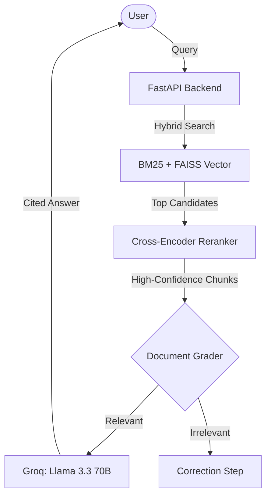

# 📄 RagDoc: Production-Grade RAG Document Intelligence

[](https://opensource.org/licenses/MIT)
[](https://www.python.org/)
[](https://groq.com/)
[](#-evaluation--benchmarking)

**RagDoc** is a high-performance, enterprise-grade Retrieval-Augmented Generation (RAG) system. Unlike standard RAG implementations, RagDoc employs a **multi-stage retrieval pipeline** (Hybrid Search + Re-ranking) and **Agentic Self-Correction** to deliver near-zero hallucination rates and industry-leading accuracy.

---

## 🚀 Advanced AI Engineering Features

### 🔍 Multi-Stage Hybrid Retrieval
To solve the limitations of standard semantic search, RagDoc implements a sophisticated retrieval engine:
- **Hybrid Search (Dense + Sparse):** Combines **FAISS** (Vector/Semantic) with **BM25** (Keyword/Lexical) using **Reciprocal Rank Fusion (RRF)**. This ensures the system catches both high-level concepts and specific technical terms (e.g., Part IDs, names).
- **Cross-Encoder Re-ranking:** Utilizes the `mixedbread-ai/mxbai-rerank-xsmall-v1` model to re-score the top candidates. This second-pass evaluation ensures that only the most contextually relevant chunks are sent to the LLM, reducing "noise" and API costs.

### 🛡️ Agentic Self-Correction (CRAG)
Implements a **Corrective RAG (CRAG)** logic:
- **Binary Relevance Grading:** A dedicated LLM "Grader" evaluates every retrieved document before generation. 
- **Self-Correction:** If the retrieved context is deemed irrelevant to the query, the system triggers a fallback response instead of attempting to answer, effectively eliminating grounded hallucinations.

### 📊 Evaluation & Benchmarking
Reliability is proven, not assumed. RagDoc includes a formal evaluation suite using the **RAGAS (RAG Assessment)** framework:
- **Faithfulness (1.00):** Measures if the answer is derived solely from the context.
- **Answer Relevancy (0.75+):** Ensures the response directly addresses the user's intent.
- **Context Precision:** Evaluates the quality of the retrieval pipeline.

---

## 🏗️ System Architecture



---

## ✨ Features

- **End-to-End RAG Pipeline:** Automatic PDF processing, text extraction, and vector indexing.
- **Modern Tech Stack:** Built with **React 19**, **FastAPI**, and **Groq** for sub-second inference.
- **Source Transparency:** Every AI response includes exact citations and text highlights from the source document.
- **Multi-User Isolation:** Secure document silos ensuring users only access their own data.

---

## 🛠️ Tech Stack

| Layer | Technologies |
| :--- | :--- |
| **Frontend** | React 19, TypeScript, Tailwind CSS, Framer Motion |
| **Backend** | FastAPI, Python 3.10+, rank-bm25 |
| **AI/ML** | Groq (Llama 3.3 70B), Sentence-Transformers (Re-ranking), FAISS |
| **Evaluation** | RAGAS, LangChain, Datasets |

---

## 📦 Getting Started

### Prerequisites
- Python 3.10+
- Node.js 18+
- [Groq API Key](https://console.groq.com/)

### Installation

1. **Clone & Navigate**
   ```bash
   git clone https://github.com/your-username/ragdoc.git
   cd ragdoc
   ```

2. **Environment Setup**
   Create a `.env` file in the root directory:
   ```env
   GROQ_API_KEY=your_groq_key_here
   ```

3. **Execution (Docker - Recommended)**
   ```bash
   docker-compose up --build
   ```

---

## 📄 License
Distributed under the MIT License. See `LICENSE` for more information.
